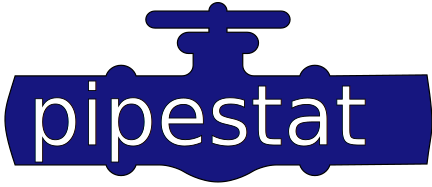

[](https://codecov.io/gh/pepkit/pipestat)
<br></br>
 

# What is this?

Pipestat standardizes reporting of pipeline results. It formalizes a way for pipeline developers and downstream tools developers to communicate. 

# How does it work?

Thanks to a schema-derived specifications, results produced by a pipeline can easily and reliably become an input for downstream analyses. The package offers a Python API and command line interface for results reporting and management and can be backed by either a [YAML-formatted file](https://yaml.org/spec/1.2/spec.html) or a [PostgreSQL database](https://www.postgresql.org/). This way the reported results persist between multiple sessions and can be shared between multiple processes.

# Quick start

## Install

```console
pip install pipestat
```

## Report result

From command line:

```console
pipestat report -f results.yaml -n namespace -r record_id -i result_name -v 1.1 -s schema.yaml
```

From Python:

```python
import pipestat
psm = pipestat.PipestatManager(name="namespace", results_file="results.yaml", schema_path="schema.yaml")
psm.report(record_identifier="record_id", result_identifier="result_name", value=1.1)
```
 

