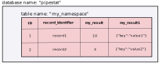

# Backends specification

Pipestat supports two types of backends that the results can be reported to: a [YAML-formatted file](https://yaml.org/spec/1.2/spec.html) or a [PostgreSQL database](https://www.postgresql.org/). This way the reported results persist between multiple sessions and can be shared between multiple processes.

Both backends reflect the intrinsic hierarchy of each reported result, which is *always* structured this way:


## YAML file

In case of YAML file backend, there is one file per namespace requirement. No two namespaces can write to a single file. Therefore there is always a single top-level key which indicates the namespace. Second-level keys correspond to the record identifiers, whereas third-level ones to the result identifiers, which point to the reported values.

```yaml
my_namespace:
    record1:
        my_result: 10
        my_result1: 
            key: "value1"
    record2:
        my_result: 3
        my_result1: 
            key: "value2"
```  

## PostgreSQL database

In case of PostgreSQL backend the name of the database that pipestat will try to connect to is configurable and defined in the [config file](config.md) in `database.name`. The namespace is indicated by the name of the table, record identifier by the *unique* `record_indentifier` column in that table and results as other columns in this row. 

